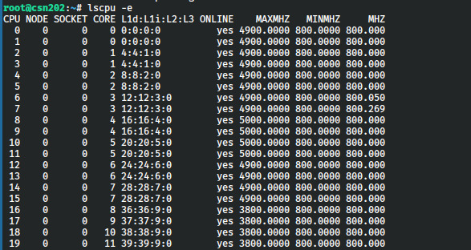
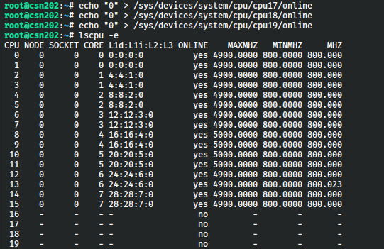

# DesativarE_cores

Esse reposítório contém a descrição de como desativar os núcleos de eficiência das arquiteturas Intel Alder Lake em diante (12º geração).

Esse tipo de arquitetura faz com que o [SLURM](https://slurm.schedmd.com/overview.html) (gerenciador de filas do [lsncs](https://www.fct.unesp.br/#!/labsimnum)) não interprete corretamente a CPU, que para o SLURM a quantidade de núcleos e threads do processador deveriam ser múltiplos. As configurações no SLURM são indicadas da seguinte forma:

```
console
```

Assim, após ver o seguinte vídeo (sem ligação alguma com o conteúdo, apenas sendo um tópico de Linux), no minuto 5:15:

https://www.youtube.com/watch?v=IYXlgzrZRIE&t=536s

A frase "Of course, it's Linux. So there is a way to force anything to do something you want." fez com que a ideia de talvez ser possível desativar os núcleos de eficiência surgisse na minha cabeça. Pesquisei e encontrei em alguns fóruns o que procurava.

# Como desativar

1. Primeiramente, entrar no site da Intel e verificar qual a arquitetura do processador usado na máquina, assim conseguimos verificar qual a CPU evitando erros;

2. Fazer ssh como root na máquina na qual os E-cores serão desativados;

3. Usar o comando e verificar a saída;
    

    1. Podemos observar que a lista de CPU vai de 0-20 (20 threads);
    2. Também, na lista de CORE temos números de 0-11 (12 núcleos);
    3. Observando com maior atenção podemos ver que os COREs 8-11 estão somente em uma única CPU (thread), isso caracteriza os E-cores. Serão esses que serão desativados.

4. Assim, podemos usar o comando ```ls -l /sys/devices/system/cpu``` apenas para ver as CPUs listadas;

5. Para desativar os E-cores, usamos o seguinte comando para desativar os CPUs 16-19, correspondentes aos COREs 8-11:

    ```bash
    echo 0 > "/sys/devices/system/cpu/cpu16/online"
    echo 0 > "/sys/devices/system/cpu/cpu17/online"
    echo 0 > "/sys/devices/system/cpu/cpu18/online"
    echo 0 > "/sys/devices/system/cpu/cpu19/online"
    ```
6. Pronto, núcleos desativados. Para verificar se os E-cores foram desativados, podemos usar o comando ```lscpu``` novamente e verificar a saída.

    


# Arquivos

